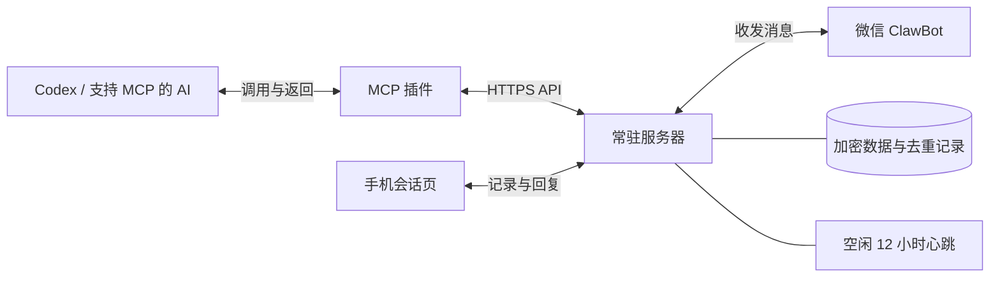

# WeChat Notify Bridge

**微信通知桥：让 AI 通过 HTTP API 或 MCP 插件发送微信消息、读取回复，并由服务器管理空闲心跳。**

项目分为两个组件：服务器负责长期在线，MCP 插件负责把 API 包装成 AI 可以调用的工具。

```text
wechat-notify-bridge/
├── README.md                 项目入口
├── docs/                     API、手机会话、唤醒与排版指南
├── scripts/                  共用文件同步与源码包构建
├── server/                   常驻服务（独立 Python 包）
│   ├── src/wechat_bridge/
│   │   ├── app.py            应用组装、鉴权与生命周期
│   │   ├── api/              管理端、客户端、手机端 HTTP 路由
│   │   ├── services/         收发、心跳、微信指令与手机会话
│   │   ├── storage/          SQLite、客户端、会话与加密图片
│   │   ├── wechat/           微信协议与扫码配对
│   │   ├── mcp/              工具、OAuth 与事件订阅
│   │   └── web/              admin / chat / oauth / vendor
│   ├── scripts/              初始化配置与旧绑定导入
│   ├── deploy/               Nginx 示例
│   ├── tests/                服务回归测试
│   ├── pyproject.toml        安装和资源打包声明
│   └── compose.yaml          Docker 部署入口
└── mcp-plugin/               可独立分发的 MCP 插件
    ├── server/               stdio 适配与桌面唤醒接收器
    ├── skills/               AI 调用规范
    ├── tools/                远程插件包构建
    └── tests/                插件回归测试
```

## 工作方式



AI 发消息时调用插件；服务器持续接收微信回复，AI 可以按需读取。关闭电脑后，服务器仍可接收消息并管理心跳。也可以跳过 MCP，由其他程序直接调用 HTTP API。

## 已实现

- 部署后打开网页扫码绑定，查看连接状态与心跳时间；支持验证码和同账号重新绑定。
- 独立管理员密钥；AI 客户端无法生成二维码或修改绑定。
- 一个微信账号连接多个 AI 客户端，每个客户端独立密钥，消息自动标记真实来源。
- 微信 `/getkey`、`/list`、`/resetkey`、`/revoke`、`/rename`、`/status`、`/help` 与 Admin 页面共用客户端数据。
- Admin 支持确认后删除客户端密钥，保留历史消息；同名可重新创建。微信指令和管理页面统一使用北京时间（UTC+8）。
- 发送 Markdown 消息和结构化任务提醒，指令回复统一排版；收件人固定为本人。
- 消息附带手机会话链接，支持完整正文、双向记录、直接回复及读取状态，详见 [手机会话页](docs/server/CHAT.md)。
- 按游标读取微信和网页回复；不同客户端可以各自保存读取进度。
- 发送去重、结果查询、API 密钥鉴权。
- SQLite 持久化；微信凭据、上下文和会话双向正文加密存储。
- 收发后推迟 12 小时，持续空闲才发送心跳；服务重启后保留计时。
- MCP 插件提供 9 个工具，可用于 Codex 或其他支持 stdio MCP 的客户端，支持同一密钥下登记多个聊天简称。

## 从哪里开始

| 你的目的 | 阅读入口 |
| --- | --- |
| 理解、运行或部署微信服务 | [服务器说明](server/README.md) |
| 在 AI 客户端接入现有服务 | [MCP 插件说明](mcp-plugin/README.md) |
| 让其他程序直接调用 API | [API 文档](docs/server/API.md) · [OpenAPI](server/openapi.json) |
| 在微信管理客户端与密钥 | [微信指令说明](docs/server/COMMANDS.md) |
| 优化微信消息排版、查阅支持的格式 | [微信 Markdown 排版指南](docs/wechat-markdown/微信Markdown排版指南.md) |
| 了解 AI 应该怎样使用工具 | [插件 Skill](mcp-plugin/skills/wechat-notify/SKILL.md) |
| 修改收发、心跳和去重行为 | [核心实现](server/src/wechat_bridge/services/bridge.py) · [测试](server/tests/test_service.py) |

## 心跳和消息路由

正常收发会把心跳时间推迟 12 小时。网页回复、查询状态、读取历史消息、重复请求和失败发送不算新的微信活动；心跳自身成功也计入活动。微信明确报告会话过期时会暂停心跳，避免反复发送。

心跳用于检验空闲后的连接情况，**不能保证微信会话一定续期**。微信接口接受请求也不代表手机已经收到或用户已经阅读。

当前只绑定一个微信账号。密钥确定客户端，聊天登记确定简称。一个启用聊天显示 `[codex]`，多个显示 `[codex-tibo]`、`[codex-通知桥]`。Skill 优先采用用户称呼，否则按任务取简短名称，缺省使用数字。MCP 可以列出本密钥下的聊天。

微信发送 `[codex-tibo] 内容` 路由至对应聊天的收件箱，`/chats` 查看准确标签。未带标签、未知或含糊标签留在公共收件箱；管理指令与密钥回复不进入 AI 消息列表。默认由 AI 主动读取；Windows 桌面可显式启用实验性的[消息唤醒接收器](mcp-plugin/DESKTOP-WAKE.md)。消息内容不会自动获得执行授权。

## 开发与验证

调整微信消息模板前，先查阅 [微信 Markdown 排版指南](docs/wechat-markdown/微信Markdown排版指南.md)。指南针对微信 ClawBot 消息；手机会话页的 Markdown 渲染由 `server/src/wechat_bridge/web/chat/` 管理，两者的支持范围可能不同。MCP 插件随包携带同一指南的副本，更新项目指南时同步 `mcp-plugin/skills/wechat-notify/references/wechat-markdown.md`，保持 AI 调用规范一致。

需要 Python 3.12。以下命令在项目根目录执行：

```bash
python -m pip install -e ./server -r server/requirements-dev.txt -r mcp-plugin/requirements.txt
python -m pytest -q
python scripts/check_project.py
python scripts/build_release.py
```

测试使用模拟微信接口，不发送真实消息。发布目录内不包含真实账号、API 密钥、服务器地址或历史聊天数据；示例地址使用 `example.com`。本目录可独立作为 GitHub 仓库根目录。

网页绑定和服务器可在 Linux Docker 中运行，不依赖 Windows。旧 Windows DPAPI 绑定辅助工具保留供兼容导入。长期心跳效果、微信会话续期，以及新增环境的实际扫码和端到端收件效果需要在各自环境验证。

参考：[腾讯微信客户端协议](https://github.com/Tencent/openclaw-weixin/blob/main/docs/protocol_zh_CN.md) · [MCP Python SDK](https://github.com/modelcontextprotocol/python-sdk)

## 云端与本机插件

服务 1.9.1 提供 OAuth 授权的远程 MCP；插件 1.5.0 可生成云端与本机共用的远程连接包。原 stdio 接入仍可用。详见 [远程 MCP 接入与授权](docs/server/REMOTE-MCP.md)。

手机端支持归档、删除及返回导航，规则与存储说明见 [手机对话管理](docs/mobile-conversations.md)。

图片回复用法、存储和部署限制见 [手机图片回复](docs/server/IMAGES.md)。

源码包输出到 `dist/`。目录职责、依赖关系与维护约定见 [项目结构](docs/architecture.md)，升级注意事项见 [1.9.0 整理说明](docs/release-1.9.0.md)。

插件和 Skill 的规范优化见 [设计依据与场景](docs/plugin-design.md)及 [服务器 1.9.1 / 插件 1.5.0 说明](docs/release-1.9.1.md)。源码更新、插件安装与远程服务升级分别生效。
