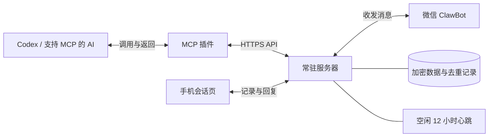

# WeChat Notify Bridge

**微信通知桥：让 AI 通过 MCP 向微信 Bot 发送通知，将系统异常、任务进展和需要人工处理的事项推送到你的微信。**

核心用途是为 AI 提供微信通知能力。在配置并授权的工作流中，AI 发现系统异常、任务失败，或遇到需要人工确认的问题时，可以调用 MCP 工具，将问题摘要和待处理事项发送到绑定用户的微信，方便用户离开电脑后及时获知并跟进。异常检测与通知触发由接入的 AI 或监控流程负责，通知桥负责消息传递。

同时支持直接调用 HTTP API、读取微信与手机会话页回复，并由服务器管理空闲心跳。普通监控脚本、定时程序或其他应用也能接入，不要求调用方是 AI。

需要本人决定时，可以发送 [任务卡片](docs/server/TASK-CARDS.md)：微信提醒后，打开手机会话页选择方案或自行回复，决定自动回到对应应用。支持默认单选、按需多选、快捷确认、独立输入和轻量表单；普通通知仍只需调用 `sendMessage`。页面分别显示待答复、已答复、处理中和已完成，卡片组件仅在遇到卡片时加载。

手机页提供 **待我处理、会话搜索、置顶、改名和草稿恢复**。改名保留历史与唤醒绑定；查看卡片不会代替提交答复。详见 [手机端日常使用](docs/mobile-experience.md)。

项目分为两个组件：服务器负责长期在线，MCP 插件负责把 API 包装成 AI 可以调用的工具。

## 快速部署与使用

下面以 Linux 服务器、Docker Compose 和 `https://notify.example.com/wechat` 为例。请替换为自己的域名；示例地址不能直接使用。需要 Python 3.12、Git、Docker Compose、已配置域名与证书的 HTTPS 站点，以及手机微信中的 ClawBot 入口。

### 1. 下载并初始化

```bash
git clone https://github.com/CosmicCrafter/wechat-notify-bridge.git
cd wechat-notify-bridge/server
python3 -m venv .venv
.venv/bin/python -m pip install .
.venv/bin/python scripts/prepare_secrets.py --web-pairing --base-url https://notify.example.com/wechat
cp .env.example .env
```

编辑 `server/.env`，将 `WECHAT_PUBLIC_BASE_URL` 改为与上面一致的实际 HTTPS 地址。初始化生成的 `.private/provisioned/` 包含私有密钥，不提交到 Git；管理员原始密钥位于 `.private/provisioned/admin/admin.json`。已有部署升级时保留原数据和密钥，**不要重新运行初始化命令**。

### 2. 启动并配置 HTTPS

仍在 `server/` 目录执行：

```bash
mkdir -p .data
sudo chown -R 10001:10001 .data .private/provisioned/secrets
sudo chmod 700 .data .private/provisioned/secrets
sudo chmod 600 .private/provisioned/secrets/*
docker compose up -d --build
docker compose ps
curl http://127.0.0.1:18092/health
```

将 [Nginx 配置示例](server/deploy/nginx.conf) 中的 location 配置放入已有 HTTPS 站点的 server 块，检查 `nginx -t` 通过后 reload。示例包含 `/wechat/` 和远程 MCP 所需的两个根级 OAuth discovery 路径，图片请求上限为 `6m`。容器默认仅监听本机 `127.0.0.1:18092`，外部客户端通过 HTTPS 访问。

### 3. 扫码绑定并创建 AI 身份

1. 打开 `https://你的域名/wechat/admin/`，使用初始化文件中的 `admin_key` 登录。管理员密钥只用于管理页面，不填到 AI 插件。
2. 点击“生成二维码”，用手机微信扫一扫并确认；如需验证码，按页面提示输入。
3. 在微信 ClawBot 聊天框发送一句“测试”，让服务获取微信回复上下文。
4. 在 Admin 的“AI 客户端”中创建 `codex` 等身份，或在微信发送 `/getkey codex`。多个 AI 客户端分别创建身份，例如 `gpt`、`deepseek`。

### 4. 把 MCP 接入 AI

**远程 MCP：** 在支持 Streamable HTTP 与 OAuth 的宿主中配置 `https://你的域名/wechat/mcp`。首次连接时在微信发送 `/web` 获取手机登录码，登录授权页面、选择刚创建的 AI 身份，再确认授权。远程模式无需将 API 密钥粘贴给 AI。

如果宿主支持本项目的插件包，可从项目根目录生成：

```bash
server/.venv/bin/python mcp-plugin/tools/build_remote_plugin.py \
  --base-url https://notify.example.com/wechat \
  --output dist/wechat-notify-remote.zip
```

**本机 stdio：** 从项目根目录执行 `python -m pip install -r mcp-plugin/requirements.txt`，将服务地址和该 AI 身份的密钥保存在私有 JSON 文件中：

```json
{
  "base_url": "https://notify.example.com/wechat",
  "api_key": "填入该客户端的密钥，按字符串保存"
}
```

将 [MCP 客户端配置示例](mcp-plugin/examples/mcp-client.json) 中的 Python、`http_bridge.py` 和私有配置文件路径改为本机绝对路径，再加入宿主的 MCP 配置。私有文件仅允许本人访问，不放入插件包或仓库。同一个宿主选择远程或本机一种方式，避免同名工具重复。

完整接入步骤见 [MCP 插件说明](mcp-plugin/README.md) 和 [远程授权说明](docs/server/REMOTE-MCP.md)。宿主需实际支持 MCP 工具调用；自动唤醒另见 [桌面接收器](mcp-plugin/DESKTOP-WAKE.md) 和 [云端事件](docs/server/MCP-EVENTS.md)。

### 5. 发出第一条通知

可对已接入 MCP 的 AI 说：

> 请查询微信通知工具的身份，为当前聊天登记简称“系统监控”，然后发送一条“微信通知接入测试”。本任务后续如果发现系统异常、任务失败或需要我确认的问题，请通过微信通知我，写明问题摘要和需要我做的事。

工具调用流程为 `getCallerIdentity` → `registerConversation` → `sendMessage` 或 `sendNotification`。保存登记返回的 `conversation_id`，后续收发、查回执都复用它；同一事件复用原 `dedup_key`，避免重复通知。以手机实际收到测试消息作为接入验收。

你可以直接在微信回复 `[codex-系统监控] 内容`，准确标签以 `/chats` 为准；也可以点击消息下方的会话链接查看完整记录并回复。微信 `/help` 查看指令，`/status` 查看接收状态、最近发送结果与恢复建议。

发送出现 `-2` 时，可先直接从微信 ClawBot 发一条新消息，再检查发送连接。网页回复不会刷新微信上下文，12 小时心跳也不能保证上下文一直有效。接口接受不等于手机收件，结果未知时先查原发送回执，不盲目重发。

详细的备份、升级和故障处理见 [服务器部署说明](server/README.md)。

## 代理配置与私有信息

普通微信通知不要求配置 OpenAI 回调代理。只有启用了云端事件订阅，且服务器无法直连宿主回调地址时，才需要管理员自行提供合适的出站代理。

回调模块通过环境变量 `WECHAT_CALLBACK_PROXY_FILE` 读取管理员提供的只读 JSON 文件，示例见 [回调代理配置](docs/server/MCP-EVENTS.md#可选的回调代理164)。源码没有内置订阅地址、代理节点或真实账号密码；示例中的凭据均为占位符。订阅、节点、代理密码应放在服务器独立私有目录，不提交到 Git，也不打入源码或插件包。

该配置只作用于允许的宿主事件回调域名，不会将微信收发或所有服务流量自动切换到代理。标准 Compose 部署默认不启用它；具体的挂载、环境变量和内部代理连通要求见回调代理说明。

服务器 1.10.0 提供简化的 Admin 代理管理：订阅定时更新、优先规则、手动选择、节点检测、流量/到期展示及失败回退。使用 `server/compose.proxy.yaml` 启用可选 Mihomo 容器，按 [订阅与代理管理部署步骤](server/README.md#可选admin-订阅与代理管理1100) 初始化私有配置；也可接入已有 Mihomo。`.env` 提供初始订阅和更新间隔，Admin 保存后以加密持久化设置为准。

```text
wechat-notify-bridge/
├── README.md                 项目入口
├── docs/                     API、手机会话、唤醒与排版指南
├── scripts/                  共用文件同步与源码包构建
├── server/                   常驻服务（独立 Python 包）
│   ├── src/wechat_bridge/
│   │   ├── app.py            应用组装、鉴权与生命周期
│   │   ├── api/              管理端、客户端、手机端 HTTP 路由
│   │   ├── services/         收发、心跳、微信指令与手机会话
│   │   ├── storage/          SQLite、客户端、会话与加密图片
│   │   ├── wechat/           微信协议与扫码配对
│   │   ├── mcp/              工具、OAuth 与事件订阅
│   │   └── web/              admin / chat / oauth / vendor
│   ├── scripts/              初始化配置与旧绑定导入
│   ├── deploy/               Nginx 示例
│   ├── tests/                服务回归测试
│   ├── pyproject.toml        安装和资源打包声明
│   └── compose.yaml          Docker 部署入口
└── mcp-plugin/               可独立分发的 MCP 插件
    ├── server/               stdio 适配与桌面唤醒接收器
    ├── skills/               AI 调用规范
    ├── tools/                远程插件包构建
    └── tests/                插件回归测试
```

## 工作方式



AI 发消息时调用插件；服务器持续接收微信回复，AI 可以按需读取。关闭电脑后，服务器仍可接收消息并管理心跳。也可以跳过 MCP，由其他程序直接调用 HTTP API。

## 已实现

- 部署后打开网页扫码绑定，查看连接状态与心跳时间；支持验证码和同账号重新绑定。
- 独立管理员密钥；AI 客户端无法生成二维码或修改绑定。
- 一个微信账号连接多个 AI 客户端，每个客户端独立密钥，消息自动标记真实来源。
- 微信 `/getkey`、`/list`、`/resetkey`、`/revoke`、`/rename`、`/status`、`/help` 与 Admin 页面共用客户端数据。
- Admin 支持确认后删除客户端密钥，保留历史消息；同名可重新创建。微信指令和管理页面统一使用北京时间（UTC+8）。
- 发送 Markdown 消息和结构化任务提醒，指令回复统一排版；收件人固定为本人。
- 消息附带手机会话链接，支持完整正文、双向记录、直接回复及读取状态，详见 [手机会话页](docs/server/CHAT.md)。
- 按游标读取微信和网页回复；不同客户端可以各自保存读取进度。
- 发送去重、结果查询、API 密钥鉴权。
- SQLite 持久化；微信凭据、上下文和会话双向正文加密存储。
- 收发后推迟 12 小时，持续空闲才发送心跳；服务重启后保留计时。
- MCP 插件提供 9 个工具，可用于 Codex 或其他支持 stdio MCP 的客户端，支持同一密钥下登记多个聊天简称。

## 从哪里开始

| 你的目的 | 阅读入口 |
| --- | --- |
| 理解、运行或部署微信服务 | [服务器说明](server/README.md) |
| 在 AI 客户端接入现有服务 | [MCP 插件说明](mcp-plugin/README.md) |
| 让其他程序直接调用 API | [API 文档](docs/server/API.md) · [OpenAPI](server/openapi.json) |
| 在微信管理客户端与密钥 | [微信指令说明](docs/server/COMMANDS.md) |
| 优化微信消息排版、查阅支持的格式 | [微信 Markdown 排版指南](docs/wechat-markdown/微信Markdown排版指南.md) |
| 了解 AI 应该怎样使用工具 | [插件 Skill](mcp-plugin/skills/wechat-notify/SKILL.md) |
| 修改收发、心跳和去重行为 | [核心实现](server/src/wechat_bridge/services/bridge.py) · [测试](server/tests/test_service.py) |

## 心跳和消息路由

正常收发会把心跳时间推迟 12 小时。网页回复、查询状态、读取历史消息、重复请求和失败发送不算新的微信活动；心跳自身成功也计入活动。微信明确报告会话过期时会暂停心跳，避免反复发送。

心跳用于检验空闲后的连接情况，**不能保证微信会话一定续期**。微信接口接受请求也不代表手机已经收到或用户已经阅读。

当前只绑定一个微信账号。密钥确定客户端，聊天登记确定简称。一个启用聊天显示 `[codex]`，多个显示 `[codex-tibo]`、`[codex-通知桥]`。Skill 优先采用用户称呼，否则按任务取简短名称，缺省使用数字。MCP 可以列出本密钥下的聊天。

微信发送 `[codex-tibo] 内容` 路由至对应聊天的收件箱，`/chats` 查看准确标签。未带标签、未知或含糊标签留在公共收件箱；管理指令与密钥回复不进入 AI 消息列表。默认由 AI 主动读取；Windows 桌面可显式启用实验性的[消息唤醒接收器](mcp-plugin/DESKTOP-WAKE.md)。消息内容不会自动获得执行授权。

## 开发与验证

调整微信消息模板前，先查阅 [微信 Markdown 排版指南](docs/wechat-markdown/微信Markdown排版指南.md)。指南针对微信 ClawBot 消息；手机会话页的 Markdown 渲染由 `server/src/wechat_bridge/web/chat/` 管理，两者的支持范围可能不同。MCP 插件随包携带同一指南的副本，更新项目指南时同步 `mcp-plugin/skills/wechat-notify/references/wechat-markdown.md`，保持 AI 调用规范一致。

需要 Python 3.12。以下命令在项目根目录执行：

```bash
python -m pip install -e ./server -r server/requirements-dev.txt -r mcp-plugin/requirements.txt
python -m pytest -q
python scripts/check_project.py
python scripts/build_release.py
```

测试使用模拟微信接口，不发送真实消息。发布目录内不包含真实账号、API 密钥、服务器地址或历史聊天数据；示例地址使用 `example.com`。本目录可独立作为 GitHub 仓库根目录。

网页绑定和服务器可在 Linux Docker 中运行，不依赖 Windows。旧 Windows DPAPI 绑定辅助工具保留供兼容导入。长期心跳效果、微信会话续期，以及新增环境的实际扫码和端到端收件效果需要在各自环境验证。

参考：[腾讯微信客户端协议](https://github.com/Tencent/openclaw-weixin/blob/main/docs/protocol_zh_CN.md) · [MCP Python SDK](https://github.com/modelcontextprotocol/python-sdk)

## 云端与本机插件

服务 1.9.1 提供 OAuth 授权的远程 MCP；插件 1.5.0 可生成云端与本机共用的远程连接包。原 stdio 接入仍可用。详见 [远程 MCP 接入与授权](docs/server/REMOTE-MCP.md)。

手机端支持归档、删除及返回导航，规则与存储说明见 [手机对话管理](docs/mobile-conversations.md)。

图片回复用法、存储和部署限制见 [手机图片回复](docs/server/IMAGES.md)。

源码包输出到 `dist/`。目录职责、依赖关系与维护约定见 [项目结构](docs/architecture.md)，升级注意事项见 [1.9.0 整理说明](docs/release-1.9.0.md)。

插件和 Skill 的规范优化见 [设计依据与场景](docs/plugin-design.md)及 [服务器 1.9.1 / 插件 1.5.0 说明](docs/release-1.9.1.md)。源码更新、插件安装与远程服务升级分别生效。
